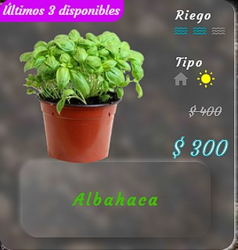
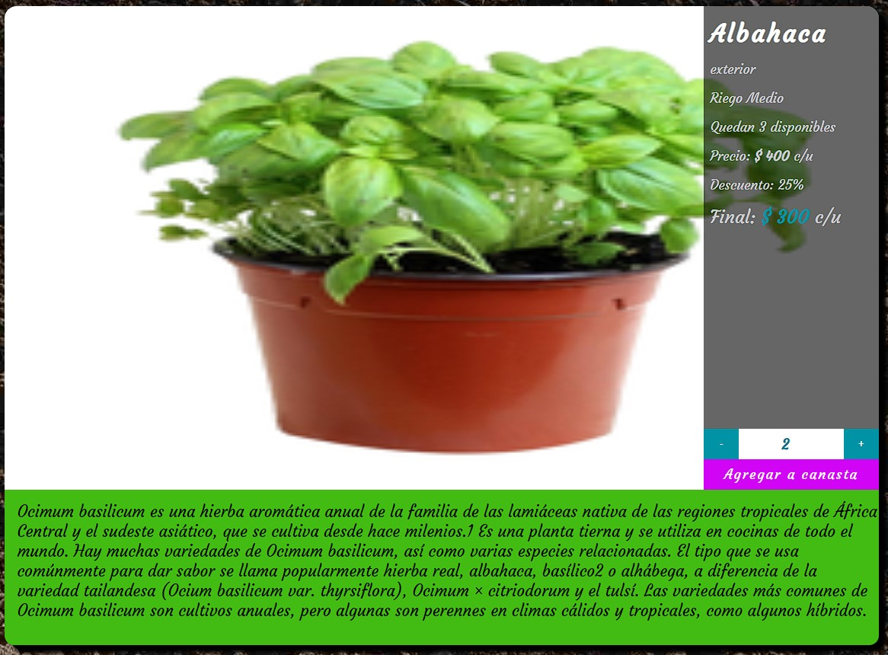
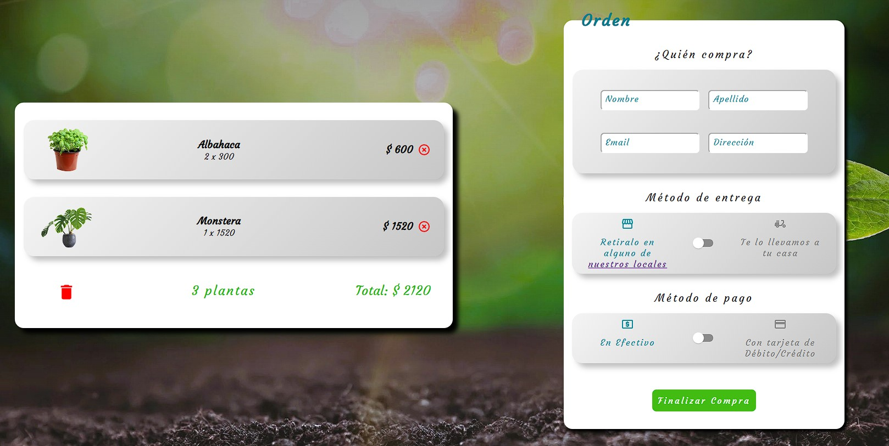
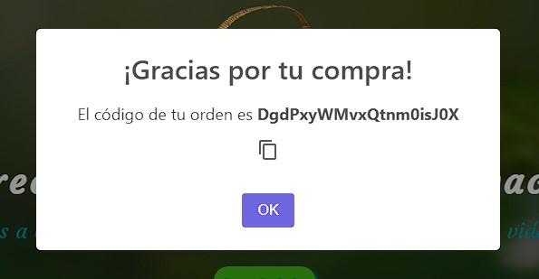
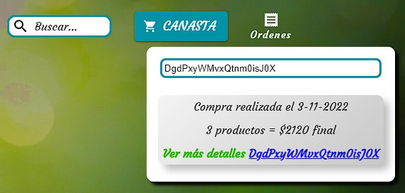

# Cubrime Que Planto Website

## Descripción + tutorial
Este sitio es un e-commerce del vivero ***Cubrime Que Planto*** en el que se ofrecen productos (plantas) clasificados en 3 categorías
- Bonsais
- Plantas de Interior
- Plantas de Exterior

En cada categoría se mostrarán todos los productos disponibles con información de:
- Nombre del producto
- Nivel de riego (bajo, medio o alto)
- Tipo de luz (interior o exterior)
- Precio original
- Precio con descuento

Se podrá ingresar a cada producto individualmente para encontrar información más detallada así como el stock disponible.

El usuario agregará a la canasta tantos productos como desee sin superar el stock y podrá finalizar la compra en cualquier momento mientras las cookies sigan activas.

La entrega de los productos podrán hacerse de las siguientes maneras:
- Retiro en local
- Entrega a docmicilio

Los medio de pago soportados son:
- Efectivo
- Tarjeta de Débito
- Tarjeta de Crédito

Al finalizar la orden de compra, el sitio devolverá un número de orden que podrá ser usado para ver los detalles en el momento que el usuario lo desee.

Los detalles se mostrarán al usar el buscador "Ordenes" en el encabezado del sitio y el usuario podrá ver todos los detalles de la orden haciendo click en el número.

## Tecnología
Este sitio fue desarrollado usando **ReactJS** para el curso de Front-End Developer de Coderhouse.

### Nube
- Firebase
    + Se utiliza la base de datos de **Firestore Database**.

### Libererías y paquetes usados
Se han utilizado los siguientes paquetes/librerías para mejorar el estilo y la experiencia de usuario del sitio

- [React Credit Cards](https://www.npmjs.com/package/react-credit-cards)
    + Para generar una vista con estilo de la tarjeta de crédito/débito que el usuario cargue al momento de finalizar la compra.
- [React Toastify](https://www.npmjs.com/package/react-toastify)
    + Para mostrar notificaciones al usuario cuando se agregua un producto a la canaste o se copia el número de orden.
- [React Cookie Consent](https://www.npmjs.com/package/react-cookie-consent) 
    + Para pedir el consentimiento del usuario al usar cookies para mejorar la experiencia en el sitio.
- [Material UI](https://mui.com/)
    + Para el estilo del sitio.

## Contacto
Revisa otros proyectos / sitios en [Github](https://github.com/edu2105)
